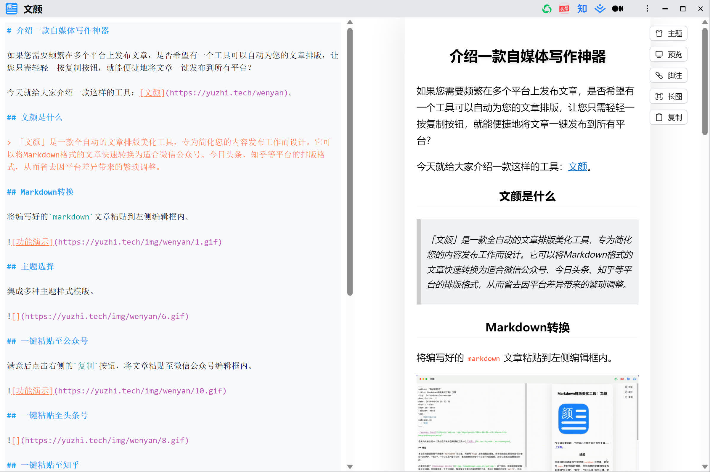

基于原项目做了以下修改：

## [2.4.2] - 2025-02-14

### 新增
- 新增字体选择功能
  - 支持在"跟随主题"、"衬线"和"无衬线"字体之间切换
  - 字体设置会被保存并在重启后保持
  - 字体选择按钮位于主题和预览按钮之间
- 新增自定义主题重命名功能，双击自定义主题名称可重命名

### 修复
- 优化了字体切换时的用户体验
- 确保字体设置不影响其他功能（如复制功能）的正常使用
- 修复任务列表复选框后文本异常换行问题
- 修复微信公众号保存时复选框丢失的问题，用☐、☑代替复选框

### 改进
- 优化自定义主题及代码高亮主题的排列顺序 

## [2.4.1] - 2025-01-29

### 新增
- 支持多种代码高亮主题（GitHub、Visual Studio、Atom Dark/Light、Monokai）
- 代码块使用 JetBrains Mono 字体
- 代码块样式优化，支持深色/浅色主题

### 修复
- 修复列表项中行内代码和加粗文本的换行问题
- 修复代码块缩进显示问题

### 改进
- 优化代码块在微信公众号中的显示效果
- 改进字体渲染 

以下是原项目的 README 内容。

---

    

# 文颜

文颜`Windows`版，`Mac`版[请戳](https://github.com/caol64/wenyan)。

## 功能

本项目的核心功能是将编辑好的`markdown`文章转换成适配各个发布平台的格式，通过一键复制，可以直接粘贴到平台的文本编辑器，无需再做额外调整。

- 支持发布到多平台：
  - 公众号
  - 知乎
  - 今日头条
  - 掘金、CSDN等
  - Medium
- 支持代码高亮
- 支持公式
- 支持链接转脚注
- 支持识别`front matter`语法
- 集成多种主题样式模版
  - [Orange Heart](https://github.com/evgo2017/typora-theme-orange-heart)
  - [Rainbow](https://github.com/thezbm/typora-theme-rainbow)
  - [Lapis](https://github.com/YiNNx/typora-theme-lapis)
  - [Pie](https://github.com/kevinzhao2233/typora-theme-pie)
  - [Maize](https://github.com/BEATREE/typora-maize-theme)
  - [Purple](https://github.com/hliu202/typora-purple-theme)
  - [物理猫-薄荷](https://github.com/sumruler/typora-theme-phycat)
- 自定义主题
  - 支持自定义样式
  - 支持导入现成的主题
  - [使用教程](https://babyno.top/posts/2024/11/wenyan-supports-customized-themes/)
  - [功能讨论](https://github.com/caol64/wenyan/discussions/9)
  - [主题分享](https://github.com/caol64/wenyan/discussions/13)
- 支持导出长图

## 应用截图

## 更多功能介绍

[https://yuzhi.tech/docs/wenyan](https://yuzhi.tech/docs/wenyan)

## 下载

[https://yuzhi.tech/docs/wenyan/download](https://yuzhi.tech/docs/wenyan/download)

## 支持

如果您觉得不错，可以给我家猫咪买点罐头吃。[喂猫❤️](https://yuzhi.tech/sponsor)

## License

Apache License Version 2.0
